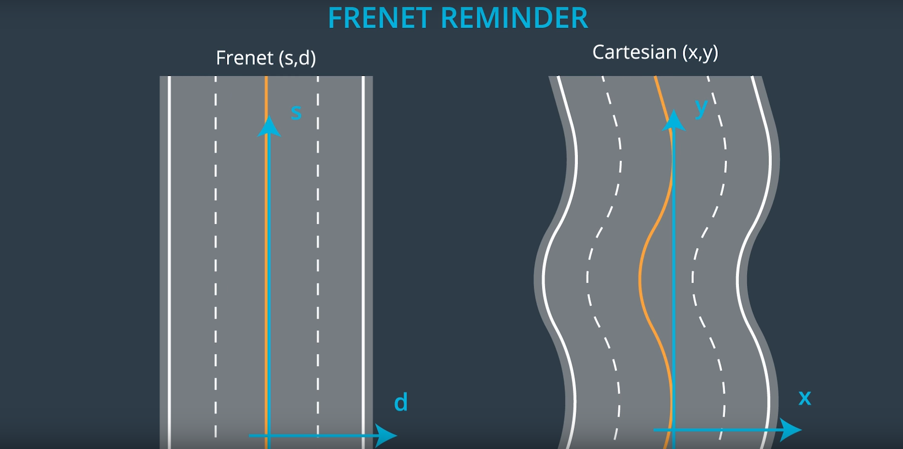

# Path Planning Project
Self-Driving Car Engineer Nanodegree Program

by olasson

[//]: # (Images)
[image1]: ./images/fernet_reminder.png

## Introduction

In this project, the goal is to design an algorithm that generates smooth paths for the ego car (the vehicle being directly controlled by the algorithm). The setting is a simulated 3 lane highway populated with traffic. The main, overall goal is to drive a distance of (at least) 4.32 miles with the following constraints:

* The car does not exceed a given speed limit.
* The car does not exceed a total acceleration of 10 m/s^2. 
* The car does not exceed a total jerk of 10 m/s^3.
* The car must not collide with any other vehicle.
* The car must stay in one of the three lanes, except when changing lanes. When a lane change occurs, the car does not spend more than 3 seconds "between" lanes.
* The car is able to smoothly change lanes when appropriate.

The algorithm is not "explicitly" defined as a state machine, although the Path Planner Module does use some internal state variables that are updated based on the current state of the car (see lines 41, 42, 43 in p`path_planner.cpp`).

## Data 

Please see README.md for an overview of the car localization data. The map data can be found in the folder "data".

## Frenet coordinates

Frenet coordinates provides a more convenient way to express the path of the ego car given a curvy road. The following image from Prediction (Lesson 8), Slide 8 summarizes the idea behind Fernet coordinates vs Cartesian coordiantes. 

     
      fernet_reminder.png

s(t) is the longitudinal coordinate and d(t) is the lateral coordinate. Fernet coordinates are ferenced from the center yellow lines, with d > 0 corresponding to the right of the yellow line, and d<0 correspondign to the left of the yellow line. 

The use of Frenet coordinate in this project is discussd in more detail under the Module: Generate Trajectory section. 

## Module: Predict Obstacles

Header: `predict_obstacles.h`
Implementation: `predict_obstacles.cpp`

Other relevant files: `obstacle.h`

The first step in the algorithm is to look for the closest obstacles in each lane ahead and behind the ego car. In `obstacle.h` a simple `struct` is defined, containing the relative distance between the ego car and the obstacle, and the current velocity of the obstacle. 

The `sensor_fusion` variable defined at line 103 in `sensor_fusion` provides the 
`predict_obstacles` function with a speed estimate which in turn is used to compute future positions of the closest obstacles found (starts at line 41 in `predict_obstacles.cpp`). Then, the following checks are performed:
* Look for obstacles ahead and behind in the same lane 
* Look for obstacles ahead and behind in the left lane
* Look for obstacles ahead and behind in the right lane

The result is stored in the vector `predicted_obstacles`. These predictions forms the basis for the cost calculations performed in `path_planner.cpp`. 

## Module: Next Action 

Header: `next_action.h`

Implementation: `next_action.cpp`

Other relevant files: `action.h`, `cost.h`, `cost.cpp`

The `next_action()` function takes in the `predicted_obstacles` vector from the Predict Obstacles Module, along with certain pieces of information about the ego car and returns an `Action{}` struct, containing a proposed lane, velocity and a "change lane" flag. This struct is essentially an answer to the question: "What should the ego car do next?". 

In order to answer this question, the `next_action()` function uses the `cost()` function found in `cost.cpp`. 

The `cost` function takes in information about the obstacly and the ego car's velocity. It then computes the total cost based on 
* Distance cost: Checks if the obstacle distance (relative to the car) is greater than a max distance. If it is, the cost is small. If it is less than the max distance, the cost is proportionally higher the closer the car is to the obstacle.
* Speed cost: If the obstacle ahead is moving faster or at the same speed as the ego car, the cost is determined based on how close the ego car velocity is to the max allowed velocity (we want the ego car to move as fast as possible when it is safe to do so!). Otherwise, the cost is the difference between the speed of the obstacle and the ego car. 

The next action `next_action()` function uses the `cost()`  function to compute cost for the following three scenarios: 
* Keep the current lane. 
* Change to left lane
* Change to right lane

It then finds the minimum of these three costs, and uses this to set the values of the `Action` struct which it then returns. 

## Module: Generate Trajectory
Header: `generate_trajectory.h`

Implementation: `generate_trajectory.cpp`

Other relevant files: `spline.h`

The `generate_trajectory` function takes in information about the ego car, an action, map waypoints and previous paths (to feed points to simulator while a new trajectory is generated). 

The overall method used is to use `spline.h` to compute a smooth trajectory. 

## Conclusion

